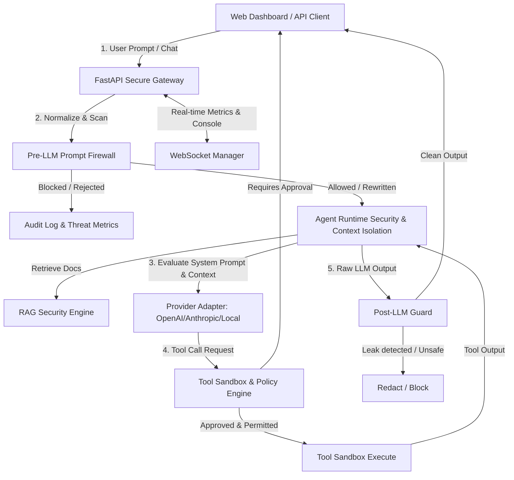

# LLM Secure Integration Hub (Prompt Injection Resistant Gateway)

LLM Secure Integration Hub is a production-grade gateway middleware engineered to connect applications to large language models while protecting them from prompt injections, system leaks, and unsafe tool escapes.

---

## Key Core Features

1. **Input Shield Normalizer & Scanner:** Translates homoglyphs, decodes unicode, strips markdown formatting, and runs rule-based regex classifiers to index threat risks (0-100).
2. **Context Isolation Engine:** Strict payload compilers that isolate system prompts and encapsulate user content in defensive XML envelopes.
3. **Interactive Sandbox & Approvals:** Classifies dynamic tools into `SAFE`, `RESTRICTED`, and `HIGH RISK` categories. HALTS restricted capabilities to request human-in-the-loop clearances before execution.
4. **Agent Runtime Loop Breaker:** Traces execution timeouts, counts recursive tool calls to intercept stack overflow loops, and checks cash budgets.
5. **RAG Poisoning Sanitizer:** Scans ingested vectors, validates chunks, and downgrades the trust ratings of untrusted user uploads.
6. **Post-LLM Guard:** Cleans assistant response text, redacting API keys, passwords, and blocking outputs mirroring system templates.

---

## Gateway System Architecture



---

## Quick-Start Guides

### 1. Run Python Backend
The project directory contains a pre-configured virtual environment containing all required libraries.
To start the FastAPI webserver:

```bash
cd backend
# Activate virtual environment
.\venv\Scripts\activate
# Start Server
python -m uvicorn app.main:app --reload --port 8000
```
*API will bind to* `http://localhost:8000`.

### 2. Run React Frontend Dashboard
To run the Vite dev server:

```bash
cd frontend
# Start dev server
npm run dev
```
*Frontend will bind to* `http://localhost:5173`.

---

## Telemetry Portal Credentials

Upon startup, the database is seeded automatically with the following profiles:
* **Administrator Portal:**
  * **Username:** `admin`
  * **Password:** `admin123`
  * *Access:* full metric audits, database cleans, policy compilation.
* **Operator Console:**
  * **Username:** `operator`
  * **Password:** `operator123`
  * *Access:* tool registrations and threshold parameters edits.

---

## Directory Schema Mapping

* `/backend/app/security/` - Core security components (firewall, sandboxing, isolation, agent controls).
* `/backend/app/routers/` - Modular endpoints for audits, scanning, auth, and gateway pipeline.
* `/backend/tests/` - Pytest verification test suite.
* `/frontend/src/` - React dashboard panels and real-time trace socket monitors.
* `/docs/` - System threat models and API layouts.
